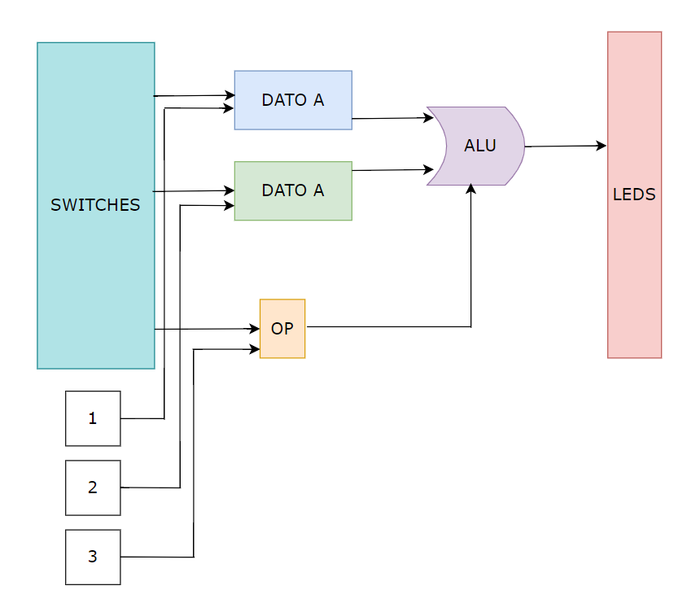
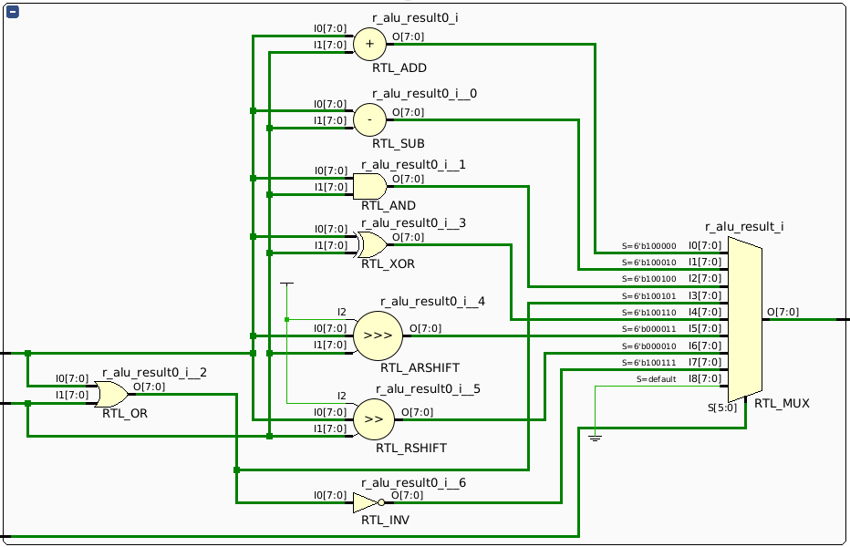
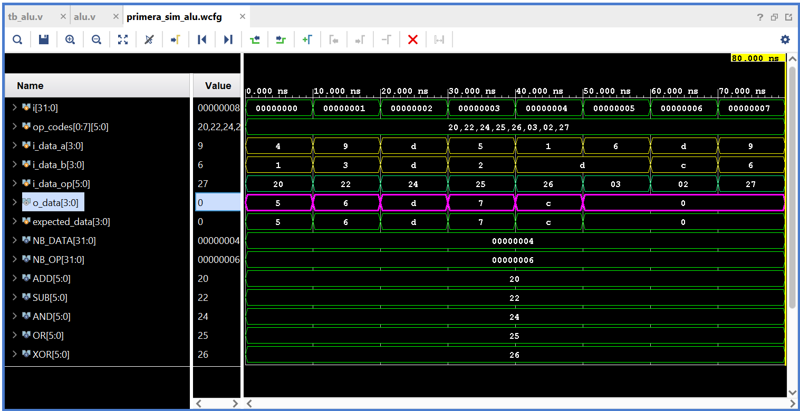
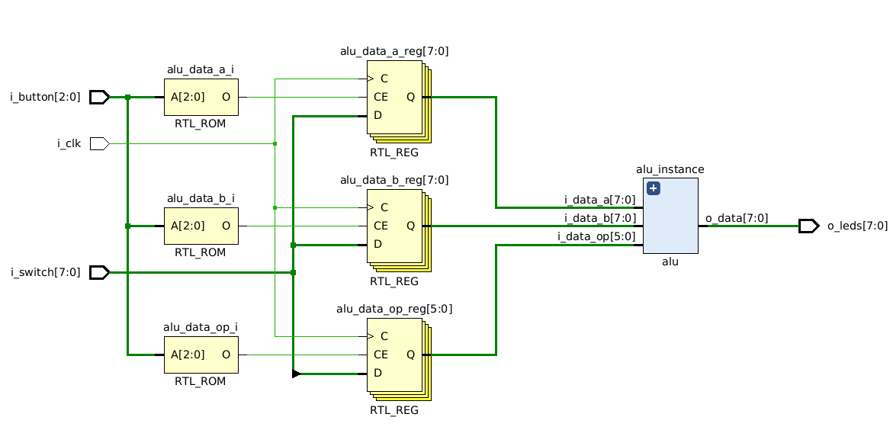

<p align="center">
  <br>
</p>

# Arquitectura de Computadoras 2024
## _TP#1 : ALU FPGA_

@ Rodriguez Luciano Ariel

@ Hernando Agustin
## Enunciado

- Implementar en FPGA una ALU.
- La ALU debe ser parametrizable (bus de datos) para poder ser utilizada posteriormente en el trabajo final.
- Validar el desarrollo por medio de Test Bench.
- El testbench debe incluir generación de entradas aleatorias y código de chequeo automático.
- Simular el diseño usando las herramientas de simulación de vivado incluyendo análisis de tiempo.

### Operaciones

| Operacion | Código    | 
|-----------|-----------|
| ADD       | 100000   | 
| SUB       | 100010   | 
| AND       | 100100   |
| OR        | 100101   |
| XOR       | 100110   |
| SRA       | 000011   |
| SRL       | 000010   |
| NOR       | 100111   |


<p align="center">
  <br><br>
  <em>Fig. Arquitectura</em>
</p>

## Desarrollo

### ALU

En primera instancia se define el módulo ALU. Este modulo se encarga de realizar las operaciones definidas segun las entradas que ingresan. 

Para empezar creamos el modulo siguiendo las caracteristicas del enunciado. Los `parametros` son la cantidad de bits de los operandos y del codigo de operacion, por defecto el modulo define como `8 bits` para los operandos y de`6 bits` para el código de operación. 

Luego tenemos las entradas al módulo `i_data_a`, `i_data_b`, `i_data_op` que representan el `operando A`, `operando B`, y el `codigo de operacion OP`. De aca resaltamos que son entradas y salidas signadas, excepto el código de operacion.


```verilog
module alu #                                //parametros
(       
    parameter NB_DATA=  8,                  //bits de datos
    parameter NB_OP = 6                     //bits de operacion  
)
(
    output signed [NB_DATA-1:0] o_data,     //ouput data
    input signed [NB_DATA-1:0] i_data_a,    //input A data
    input signed [NB_DATA-1:0] i_data_b,    //input B data
    input [NB_OP-1:0] i_data_op             //input OP data
    
);
```

La lógica de cada operación se va a realizar en un bloque `always`, donde no podemos asignar directamente el valor de nuestro resultado `output` que es un `wire`. Esto es porque el `wire` representa una señal de conexion continua, y nosotros tratamos el modulo como puramente combinacional, es decir se calculan en momentos especificos los valores de resultado segun las variaciones de ciertas entradas. Por todo esto, necesitamos un registro auxiliar que modificaremos como si fuera nuestro resultado, y que nos va a servir para asignarle el mismo valor, fuera del always, a la señal de salida.

```verilog
reg [NB_DATA-1:0] r_alu_result;     //registro temporal de resultado 
```

Ahora si vamos con el bloque always donde se asignaran los resultados segun la operacion. También, vale aclarar que el bloque funciona como `always @(*)`, es decir, de manera combinacional. Esto hace que se ingrese al bloque cada vez que varíen las señales que utilizamos dentro de él. 

```verilog
always@(*) begin
    case (i_data_op)                                        //segun la operacion
        6'b100000: r_alu_result = i_data_a + i_data_b;      //ADD
        6'b100010: r_alu_result = i_data_a - i_data_b;      //SUB
        6'b100100: r_alu_result = i_data_a & i_data_b;      //AND
        6'b100101: r_alu_result = i_data_a | i_data_b;      //OR
        6'b100110: r_alu_result = i_data_a ^ i_data_b;      //XOR
        6'b000011: r_alu_result = i_data_a >>> i_data_b;    //SRL
        6'b000010: r_alu_result = i_data_a >> i_data_b;     //SRA
        6'b100111: r_alu_result = ~(i_data_a | i_data_b);   //NOR
        default: r_alu_result =  {NB_DATA{1'b0}};           //default
    endcase
end
```
Dejamos de manera descriptiva los casos de las operaciones pero podemos asignarle tags de manera más amigable con `localparam`. Finalmente realizamos el `assign` del output con nuestro registro temporal.

```verilog
assign o_data = r_alu_result;       //asignacion de resultado a output
```

Podemos observar por lo tanto en el multiplexor a la variable temporal de forma esquematica:

<p align="center">
  <br>
  <em>Fig. Diagrama RTL</em>
</p>

#### Testbench ALU

Una vez definido el modulo podemos simular el comportamiento del mismo mediante los testbenchs. Para esto volvemos a definir un modulo pero que no tiene entradas ni salidas sino que se mapea sobre el modulo que teniamos antes.  Para esto volvemos a declarar, los `parameter`'s, usamos `localparam` para las operaciones, registros signados que representan las entradas y salidas, y también registros auxiliares.

```verilog
module tb_alu;  

    
    parameter NB_DATA = 8;                  // Parametros
    parameter NB_OP = 6;
    
                                
    localparam ADD = 6'b100000;             // Operaciones 
    localparam SUB = 6'b100010;
    localparam AND = 6'b100100;
    localparam OR = 6'b100101;
    localparam XOR = 6'b100110;
    localparam SRA = 6'b000011;
    localparam SRL = 6'b000010;
    localparam NOR = 6'b100111;
    
    integer i;                              // Entero auxiliar para iteraciones
    reg [NB_OP-1:0] tb_op_codes[0:7];       // Arreglo de operaciones auxiliar
    

    reg signed [NB_DATA-1:0] tb_i_data_a;   // Input A data
    reg signed [NB_DATA-1:0] tb_i_data_b;   // Input B data
    reg [NB_OP-1:0] tb_i_data_op;           // Input OP data
    wire signed [NB_DATA-1:0] tb_o_data;    // Output data

    reg signed [NB_DATA-1:0] expected_data; // Registro para comparar
```

Ahora hacemos una instancia del modulo de la ALU, con respecto a nuestros registros. 

```verilog
alu #(.NB_DATA(NB_DATA), .NB_OP(NB_OP)) uut (
        .i_data_a(tb_i_data_a),
        .i_data_b(tb_i_data_b),
        .i_data_op(tb_i_data_op),
        .o_data(tb_o_data)
    );
```

Y finalmente en un bloque `initial`, aparte de asignaciones, realizamos calculos y se chequean los resultados. En este caso, usamos el arreglo de operaciones y recorremos el mismo aplicandolo sobre los operandos.

```verilog
 for (i = 0; i < 8; i = i + 1) begin
            tb_i_data_a = $random % (1 << NB_DATA);  // Randon en rango [-8,7]
            tb_i_data_b = $random % (1 << NB_DATA);  // Randon en rango [-8,7]
            
            tb_i_data_op = tb_op_codes[i];           // Codigo de operacion

            case (tb_i_data_op)
                ADD: expected_data = tb_i_data_a + tb_i_data_b;
                SUB: expected_data = tb_i_data_a - tb_i_data_b;
                AND: expected_data = tb_i_data_a & tb_i_data_b;
                OR: expected_data = tb_i_data_a | tb_i_data_b;
                XOR: expected_data = tb_i_data_a ^ tb_i_data_b;
                SRA: expected_data = tb_i_data_a >>> tb_i_data_b;
                SRL: expected_data = tb_i_data_a >> tb_i_data_b;
                NOR: expected_data = ~(tb_i_data_a | tb_i_data_b);
                default: expected_data = {NB_DATA{1'b0}}; 
            endcase

            #10; // Wait

            if (tb_o_data !== expected_data) begin //Check respuesta
                $display("ERROR: A = %d, B = %d, OP = %b, Esperado = %d, Obtenido = %d",
                         tb_i_data_a, tb_i_data_b, tb_i_data_op, expected_data, tb_o_data);
            end else begin
                $display("OK: A = %d, B = %d, OP = %b, Resultado = %d", 
                         tb_i_data_a, tb_i_data_b, tb_i_data_op, tb_o_data);
            end
        end
```

Podemos chequear los resultados utilizando las utilidades de waveforms de Vivado

<p align="center">
  <br>
  <em>Fig. TestBench ALU.</em>
</p>

### TOP

El TOP es el código que instanciará y hará uso a los submodulos como lo es el modulo ALU, la idea aquí es utilizar los switches físicos de la placa para cargar los valores del operando A, operando B y codigo de operación.

Los `parametros` son, al igual que el modulo de ALU, la cantidad de bits de los operandos y codigo de operación, adicionalmente se añaden un parámetro para definir la cantidad de bits del switch, en este caso `8 bits` y otro parametro para definir la cantidad de bits para los botones, en este caso `3 bits`.

A continuación se definen las entradas y salidas del módulo, siendo las entradas el botón A, botón B y el botón OP definidas en el array `i_button` y el `i_switch` donde se configurará la palabra de bits a ingresar, por otro lado la salida será el resultado de enviar los operandos y el codigo de operacion a la ALU. Se podrá visualizar el resultado, por ejemplo, en los leds de la placa.


```verilog
module top                              //parametros
#(
    parameter NB_DATA=  8,              //data
    parameter NB_OP = 6,                //op
    parameter NB_BITS = 8,              //bits of sw
    parameter NB_BUTTON = 3             //bits of btn
)
(
    input wire [NB_BITS-1:0] i_switch,  //input of switch
    input wire [NB_BUTTON-1:0] i_button,//input of buttons
    input wire i_clk,                   //input clock
    output signed [NB_DATA-1:0] o_leds  //output of leds
);
```

Se definen parámetros locales para simplificar la lectura del código
```verilog
localparam BTN_DATA_A = 3'b001;
localparam BTN_DATA_B = 3'b010;
localparam BTN_DATA_OP = 3'b100;
```

Los siguientes registros son internos al módulo, esto es necesario puesto que las entradas son tipo `wire` y necesitamos guardar el estado de los cambios de las entradas en registros.

```verilog
reg [NB_DATA-1:0] alu_data_a;
reg [NB_DATA-1:0] alu_data_b;
reg [NB_OP-1:0] alu_data_op;
```

Se instancian el modulo ALU, aqui mapeamos los registros a los `wire`s del módulo para conectar y enviar la información:
```verilog
alu
#(
    .NB_DATA(NB_DATA),
    .NB_OP(NB_OP)
)
alu_instance(
    .i_data_a(alu_data_a),
    .i_data_b(alu_data_b),
    .i_data_op(alu_data_op),
    .o_data(o_leds)
);
```

Por último en el bloque `always` secuencial, el cual se activa con el flanco positivo del clock (`posedge i_clk`). Las operaciones suceden de forma sincrona con el clock capturando los datos de entrada cuando ocurre un flanco positivo y actualizando los registros de acuerdo al botón presionado.

La asignacion `<=` es no bloqueante por lo que permite que todas las operaciones dentro del bloque `always` se ejecuten simultáneamente.

`inputs` es una etiqueta que sirve para hacer el código mas legible.

```verilog
always@(posedge i_clk) begin:inputs
    case(i_button)
    BTN_DATA_A: alu_data_a <= i_switch;
    BTN_DATA_B: alu_data_b <= i_switch;
    BTN_DATA_OP: alu_data_op <= i_switch;
    endcase;
end
```

Podemos observar como se asigna el valor del switch de acuerdo al boton presionado a las diferentes entradas de la ALU:
<p align="center">
  <br>
  <em>Fig. Diagrama RTL</em>
</p>

### Constraint y configuracion de la placa

### Pruebas

### Conclusiones