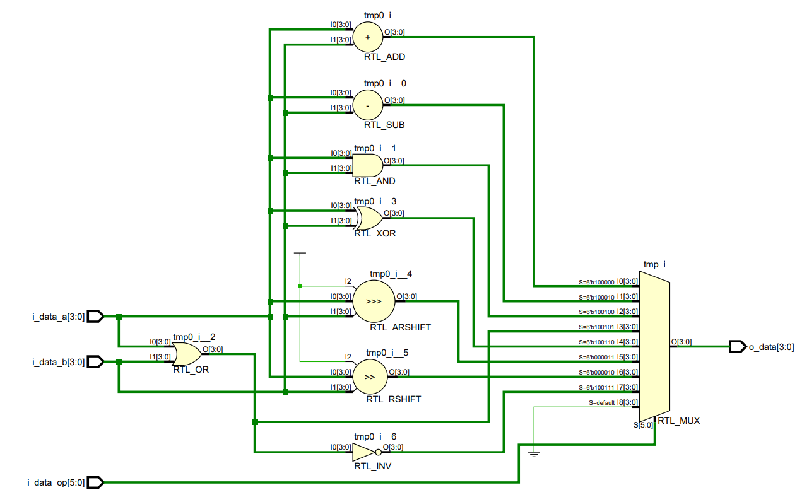

<p align="center">
  <br>
</p>

# Arquitectura de Computadoras 2024
## _TP#1 : ALU FPGA_

## Enunciado

- Implementar en FPGA una ALU.
- La ALU debe ser parametrizable (bus de datos) para poder ser utilizada posteriormente en el trabajo final.
- Validar el desarrollo por medio de Test Bench.
- El testbench debe incluir generación de entradas aleatorias y código de chequeo automático.
- Simular el diseño usando las herramientas de simulación de vivado incluyendo análisis de tiempo.

### Operaciones

| Operacion | Código    | 
|-----------|-----------|
| ADD       | 100000   | 
| SUB       | 100010   | 
| AND       | 100100   |
| OR        | 100101   |
| XOR       | 100110   |
| SRA       | 000011   |
| SRL       | 000010   |
| NOR       | 100111   |

<p align="center">
  <br>
  <em>Fig. Arquitectura</em>
</p>

## Desarrollo

### ALU

```verilog
`timescale 1ns / 1ps

module alu #
(
    parameter NB_DATA=  4,
    parameter NB_OP = 6
)
(
    output signed [NB_DATA-1:0] o_data, //ouput
    input signed [NB_DATA-1:0] i_data_a, //input A
    input signed [NB_DATA-1:0] i_data_b, //input B
    input [NB_OP-1:0] i_data_op // input OP
    
);

// tmp
reg [NB_DATA-1:0] tmp;

//always
always@(*) begin
    case (i_data_op)
        6'b100000: tmp = i_data_a + i_data_b;       //ADD
        6'b100010: tmp = i_data_a - i_data_b;       //SUB
        6'b100100: tmp = i_data_a & i_data_b;       //AND
        6'b100101: tmp = i_data_a | i_data_b;       //OR
        6'b100110: tmp = i_data_a ^ i_data_b;       //XOR
        6'b000011: tmp = i_data_a >>> i_data_b;     //SRA
        6'b000010: tmp = i_data_a >> i_data_b;      //SRL
        6'b100111: tmp = ~(i_data_a | i_data_b);    //NOR
        default: tmp = 0;                           //default
    endcase
end

assign o_data = tmp;
endmodule

```
<p align="center">
  <br>
  <em>Fig. RTL</em>
</p>